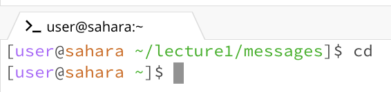
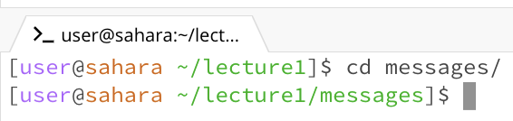
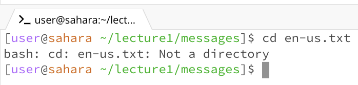
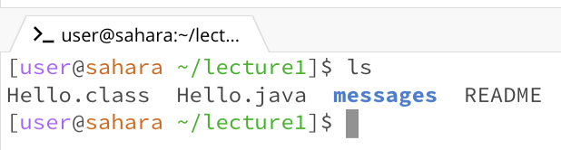
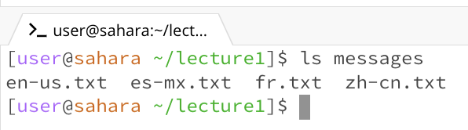
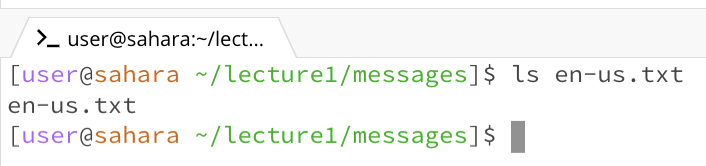
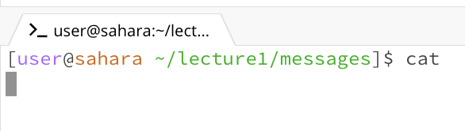

# Lab Report 1

## cd

1. No argument
   
   

   The working directory when this command was run was ~/lecture1/messages. There was no output displayed in the terminal, but the working directory was changed to the root directory. This means that using *cd* with no arguments changes the working directory to the highest-level directory. The command produced no error.

2. Directory as the argument

   

   The working directory when this command was run was ~/lecture1. There was no output displayed in the terminal, but the working directory was changed to the directory that was put as the argument, which is ./messages. The command produced no error.
   
3. File as the argument

   

   The working directory when this command was run was ~/lecture1/messages. There was an error message displayed in the terminal, and no change was made to the working directory. The error message read "not a directory", which indicates that the *cd* command can only be used with a directory as the argument.

## ls

1. No argument

   

   The working directory when this command was run was ~/lecture1. The output in the terminal was all the folders and files under the current directory. This means using *ls* with no arguments lists out all the content under the current working directory by default. No error was produced by running the command.

2. Directory as the argument

    

    The working directory when this command was run was ~/lecture1. After running the command with the argument as *messages*, the output was all the content under the *messages* directory. This means using *ls* with a directory as the argument lists out the content under that directory. This command produced no error.

3. File as the argument

    

   The working directory when this command was run was ~/lecture1/messages. After running the command with the argument as *en-us.txt*, the output was the content of the file. This means using *ls* with a file as the argument displays all the content of the file. The command produced no error.

## cat

1. No argument

   

   The working directory when this command was run was ~/lecture1/messages. After running the command with no argument, the terminal started an interactive session, where whatever I ender is displayed right after on the next line. The command produced no error.

2. Directory as the argument

   

   The working directory when this command was run was ~/lecture1/messages. 
