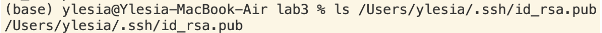
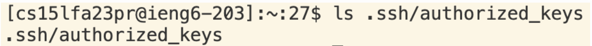
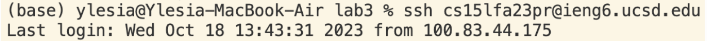

# Lab Report 1

## Part 1

### `StringServer`

### `/add-message`
1. 
From my code, `handleRequest` in `Handler` class and `main` in `StringServer` class are called. `args` in main has the argument [“2020”] which is the port number; `url.getPath()` was `/add-message`; `url.getQuery()` was `?s=Ylesia`. After this call, `currentCount` was updated to `1` and `output` was updated to “1. Ylesia\n”.

2. 
From my code, `handleRequest` in `Handler` class is called. `url.getPath()` was `/add-message`; `url.getQuery()` was `?s=Wu`. After this call, `currentCount` was updated to `2` and `output` was updated to “1. Ylesia\n2. Wu\n”.

## Part 2

1. private key

2. public key

3. No need to enter password

## Part 3
During lab in week 2, I leaned how to use `ssh` to connect to a remote computer, which will be useful if I ever need better hardware in the future. I also learned how to create a server (although most of the code in `Server` I still don't understand). It is super exciting that the server is interactable, which means I can use the basic structure of the code and build on top of it to create a server that is more useful!
