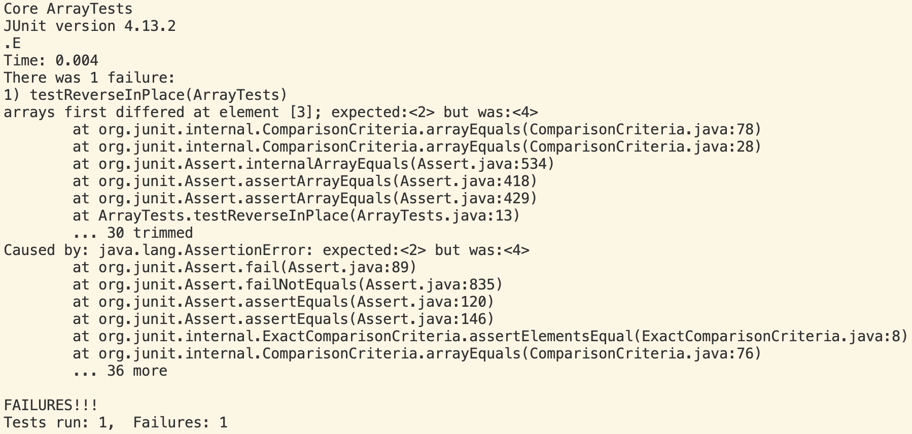
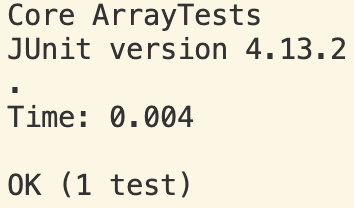

# Lab Report 3

## Part 1 - Bugs

### 1. Failure-inducing input
```
@Test 
public void testReverseInPlace() {
  int[] input = {1, 2, 3, 4, 5};
  ArrayExamples.reverseInPlace(input);
  assertArrayEquals(new int[]{5, 4, 3, 2, 1}, input);
}
```

### 2. Non-failure-inducing input
```
@Test 
public void testReverseInPlace() {
  int[] input = {1};
  ArrayExamples.reverseInPlace(input);
  assertArrayEquals(new int[]{1}, input);
}
```

### 3. symptom
Output when running failure-inducing input:



Output when running non-failure-inducing input:



### 4. bug
Before:
```
static void reverseInPlace(int[] arr) {
    for(int i = 0; i < arr.length; i += 1) {
      arr[i] = arr[arr.length - i - 1];
    }
  }
```

After:
```
static void reverseInPlace(int[] arr) {
    for(int i = 0; i < (arr.length/2); i += 1) {
      int temp = arr[i];
      arr[i] = arr[arr.length - i - 1];
      arr[arr.length - i - 1] = temp;
    }
  }
```

## Part 2 - Researching Commands

