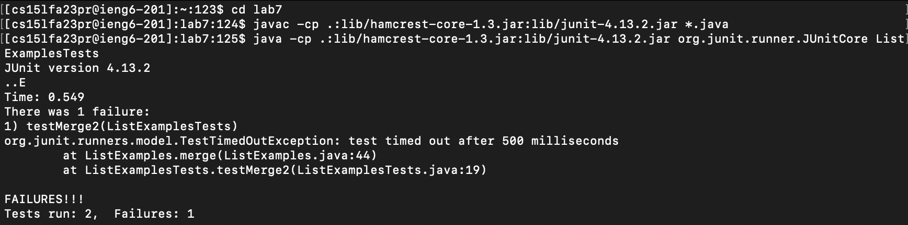

# Lab Report 4

### Step 4

Keys pressed: *ssh\<space\>cs15lfa23pr@ieng6-201.ucsd.edu\<enter\>*

I used `ssh` to connect to my ieng6 remote machine.

### Step 5

Keys pressed: *git\<space\>clone\<space\>\<command\>v*

I copied the URL for cloning the repository beforehand, so I just used `<command>v` to paste it to the terminal.

### Step 6

Keys pressed: *\cd\<space\>lab7\<enter\><command\>c\<command\>v\<enter\>\<command\>c\<command\>v\<space\>ListExamplesTests\<enter\>*

I first used `cd` to change my working directory to `lab7`. After this, I copied the `javac` command, pasted it to the terminal, and ran it. I then copied the `java` command, pasted it to the terminal, added the test file's name, and ran it.

### Step 7

Keys pressed: *vim\<space\>ListExamples.java\<enter\>?1\<enter\>nr2:wq\<enter\>*

I opened `ListExamples.java` with `vim`, searched for `1` from the bottom up using `?`, found the `1` that I was looking for by pressing `n` once, used `r` to replace the `1` with `2`, saved my edit with `:w`, and exited with `q`.

### Step 8

Keys pressed: *\<up\>\<up\>\<up\>\<enter\>\<up\>\<up\>\<up\>\<enter\>*

The `javac` command was 8 up in the history, and so was the `java` command. They are further up in the history because I used some `ls` in between commands.

### Step 9

Keys pressed: *git\<space\>add\<space\>ListExamples.java\<enter\>git\<space\>commit\<space\>-m\<space\>"lab\<space\>report"\<enter\>git\<space\>push\<enter\>*

I did `git add ListExamples.java`, `git commit -m "lab report"`, and `git push`.
