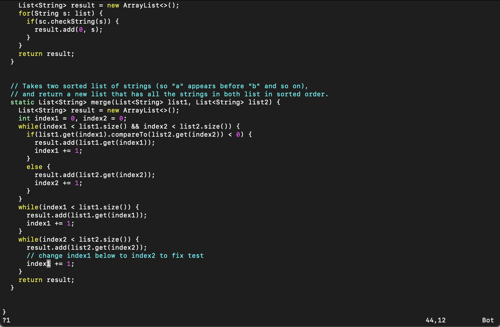
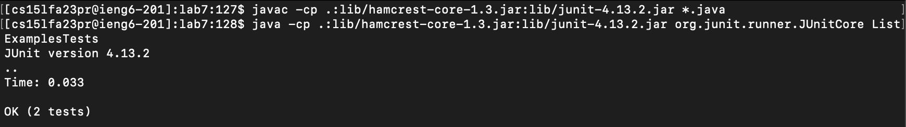

# Lab Report 4

### Step 4

I was not able to log into the ieng6 remote machine. Tanya tried to help me fix it during lab but the issue is still not fixed. She told me to work on my local machine for this lab report. My student email is `xw001@ucsd.edu`. Thank you :)

### Step 5

Keys pressed: *git\<space\>clone\<space\>\<command\>v*

I copied the URL for cloning the repository beforehand, so I just used <command> v to paste it to the terminal.

### Step 6

Keys pressed: *\<command\>c\<command\>v\<enter\>\<command\>c\<command\>v\<right\>\<space\>ListExamplesTests\<enter\>*

I copied the `javac` command, pasted it to the terminal, and ran it. I then copied the `java` command, pasted it to the terminal, added the file name, and ran it.

### Step 7

Keys pressed: *vim\<space\>ListExamples.java\<enter\>?1nr2:wq\<enter\>*

I opened `ListExamples.java` with `vim`, searched for `1` from the bottom up using `?`, found the `1` that I am looking for with pressing `n` once, used `r` to replace the `1` with `2`, saved my edit with `:w`, and exited with `q`.

### Step 8

Keys pressed: *\<up\>\<up\>\<up\>\<up\>\<up\>\<up\>\<up\>\<up\>\<enter\>\<up\>\<up\>\<up\>\<up\>\<up\>\<up\>\<up\>\<up\>\<enter\>*

The `javac` command was 8 up in the history, and so was the `java` command. They are further up in the history because I used some `ls` in between commands.

### Step 9

Keys pressed: *git\<space\>add\<space\>.\<enter\>git\<space\>commit\<space\>-m\<space\>""\<left\>lab\<space\>report\<right\>\<enter\>git\<space\>push\<enter\>*

I did `git add .`, `git commit -m "lab report"`, and `git push`.
