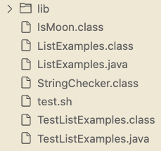

# Lab Report 5

### Part 1 - Debugging Scenario

1. Student:

Hello, I am trying to test my list methods but one of my tests is failing.


`test.sh` just contains the Junit commands:

```
CPATH='.:lib/hamcrest-core-1.3.jar:lib/junit-4.13.2.jar'

javac -cp $CPATH *.java
java -cp $CPATH org.junit.runner.JUnitCore TestListExamples
```

This is my file structure:



My list methods look like this:

```
import java.util.ArrayList;
import java.util.List;

interface StringChecker { boolean checkString(String s); }

class ListExamples {

  static List<String> result = new ArrayList<>();
  // Returns a new list that has all the elements of the input list for which
  // the StringChecker returns true, and not the elements that return false, in
  // the same order they appeared in the input list;
  static List<String> filter(List<String> list, StringChecker sc) {
    if(list.size() == 0) { return list; }
    result.clear();
    for(String s: list) {
      if(sc.checkString(s)) {
        result.add(s);
      }
    }
    return result;
  }


  // Takes two sorted lists of strings (so "a" appears before "b" and so on),
  // and return a new list that has all the strings in both lists in sorted order.
  static List<String> merge(List<String> list1, List<String> list2) {
    List<String> result = new ArrayList<>();
    int index1 = 0, index2 = 0;
    while(index1 < list1.size() && index2 < list2.size()) {
      int compared = list1.get(index1).compareTo(list2.get(index2));
      if(compared == 0) {
        result.add(list1.get(index1));
        index1 += 1;
        index2 += 1;
      }
      else if(compared < 0) {
        result.add(list1.get(index1));
        index1 += 1;
      }
      else {
        result.add(list2.get(index2));
        index2 += 1;
      }
    }
    while(index1 < list1.size()) {
      result.add(list1.get(index1));
      index1 += 1;
    }
    while(index2 < list2.size()) {
      result.add(list2.get(index2));
      index1 += 1;
    }
    return result;
  }


}
```

My test cases look like this:

```
import static org.junit.Assert.*;
import org.junit.*;
import java.util.Arrays;
import java.util.List;

class IsMoon implements StringChecker {
  public boolean checkString(String s) {
    return s.equalsIgnoreCase("moon");
  }
}

public class TestListExamples {
  
  @Test
  public void testFilter() {
    List<String> input = Arrays.asList("MOON", "mooN", "sUn");
    List<String> merged = ListExamples.filter(input, new IsMoon());
    List<String> expected = Arrays.asList("MOON", "mooN");
    assertEquals(expected, merged);
  }
  
  @Test(timeout = 500)
  public void testMergeRightEnd() {
    List<String> left = Arrays.asList("a", "b", "c");
    List<String> right = Arrays.asList("a", "d");
    List<String> merged = ListExamples.merge(left, right);
    List<String> expected = Arrays.asList("a", "a", "b", "c", "d");
    assertEquals(expected, merged);
  }
}
```

The symptom is that the test failed. The failure-inducing input was the two lists, `{"a", "b", "c"}` and `{"a", "d"}`. Can I please get some help debugging my code?

2. TA:

Try using the Java Debugger tool to help you debug. You can use the following commands:

```
javac -g -cp .:lib/hamcrest-core-1.3.jar:lib/junit-4.13.2.jar *.java
jdb -classpath .:lib/hamcrest-core-1.3.jar:lib/junit-4.13.2.jar org.junit.runner.JUnitCore TestListExamples
```

Once you have the Java Debugger initialized, enter `stop at TestListExamples:<the line number in your test case where you run the method>` and then `run`.

3. Student:

Thank you so much! I used the Java Debugger tool as you suggested and found out what the problem with my code was!

This is what I did:


In the end, I was able to find out that I was incrementing the wrong index. I have fixed my merge method, and it now looks like this:

```
import java.util.ArrayList;
import java.util.List;

interface StringChecker { boolean checkString(String s); }

class ListExamples {

  static List<String> result = new ArrayList<>();
  // Returns a new list that has all the elements of the input list for which
  // the StringChecker returns true, and not the elements that return false, in
  // the same order they appeared in the input list;
  static List<String> filter(List<String> list, StringChecker sc) {
    if(list.size() == 0) { return list; }
    result.clear();
    for(String s: list) {
      if(sc.checkString(s)) {
        result.add(s);
      }
    }
    return result;
  }


  // Takes two sorted lists of strings (so "a" appears before "b" and so on),
  // and return a new list that has all the strings in both lists in sorted order.
  static List<String> merge(List<String> list1, List<String> list2) {
    List<String> result = new ArrayList<>();
    int index1 = 0, index2 = 0;
    while(index1 < list1.size() && index2 < list2.size()) {
      int compared = list1.get(index1).compareTo(list2.get(index2));
      if(compared == 0) {
        result.add(list1.get(index1));
        index1 += 1;
        index2 += 1;
      }
      else if(compared < 0) {
        result.add(list1.get(index1));
        index1 += 1;
      }
      else {
        result.add(list2.get(index2));
        index2 += 1;
      }
    }
    while(index1 < list1.size()) {
      result.add(list1.get(index1));
      index1 += 1;
    }
    while(index2 < list2.size()) {
      result.add(list2.get(index2));
      index2 += 1;
    }
    return result;
  }


}
```

I just changed `index1` near the end of the method to `index2`, and that was it!

4. All the necessary information was incorporated into the conversation above.

### Part 2 - Reflection

The Vim Editor was super cool! I liked how it allows editing of files without having to take the trouble of opening a text editor manually and then looking for the file. The Vim tutorial that we watched during lab was pretty cool since it was interactive and allows us to learn in our own pace.

