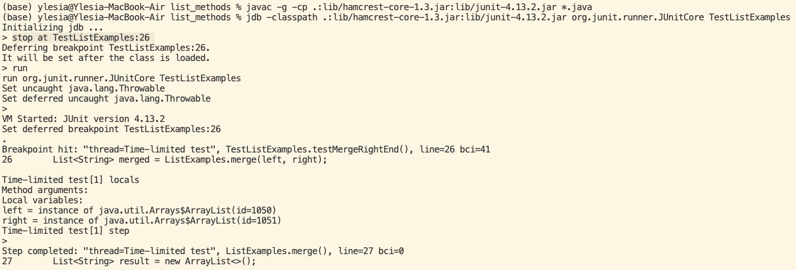
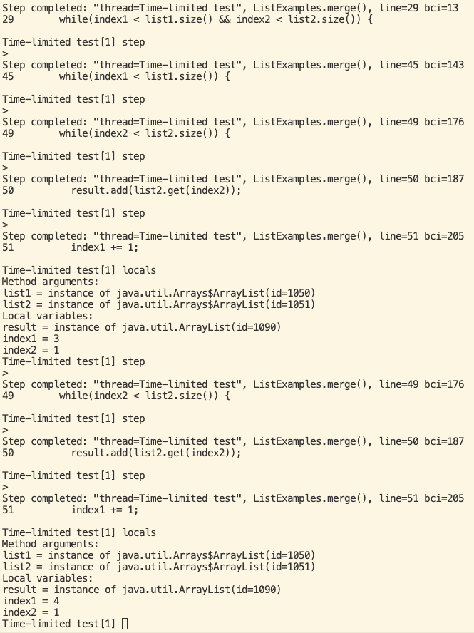

# Lab Report 5

### Part 1 - Debugging Scenario

1. Student:

Hello, I am trying to test my list methods but one of my tests is failing.


My merge method looks like this:

```
static List<String> merge(List<String> list1, List<String> list2) {
    List<String> result = new ArrayList<>();
    int index1 = 0, index2 = 0;
    while(index1 < list1.size() && index2 < list2.size()) {
      int compared = list1.get(index1).compareTo(list2.get(index2));
      if(compared == 0) {
        result.add(list1.get(index1));
        index1 += 1;
        index2 += 1;
      }
      else if(compared < 0) {
        result.add(list1.get(index1));
        index1 += 1;
      }
      else {
        result.add(list2.get(index2));
        index2 += 1;
      }
    }
    while(index1 < list1.size()) {
      result.add(list1.get(index1));
      index1 += 1;
    }
    while(index2 < list2.size()) {
      result.add(list2.get(index2));
      index1 += 1;
    }
    return result;
  }
```

My test cases looks like this:

```
import static org.junit.Assert.*;
import org.junit.*;
import java.util.Arrays;
import java.util.List;

class IsMoon implements StringChecker {
  public boolean checkString(String s) {
    return s.equalsIgnoreCase("moon");
  }
}

public class TestListExamples {
  
  @Test
  public void testFilter() {
    List<String> input = Arrays.asList("MOON", "mooN", "sUn");
    List<String> merged = ListExamples.filter(input, new IsMoon());
    List<String> expected = Arrays.asList("MOON", "mooN");
    assertEquals(expected, merged);
  }
  
  @Test(timeout = 500)
  public void testMergeRightEnd() {
    List<String> left = Arrays.asList("a", "b", "c");
    List<String> right = Arrays.asList("a", "d");
    List<String> merged = ListExamples.merge(left, right);
    List<String> expected = Arrays.asList("a", "a", "b", "c", "d");
    assertEquals(expected, merged);
  }
}
```

The symptom is that the test failed. The failure-inducing input was the two lists, {"a", "b", "c"} and {"a", "d"}. Can I please get some help debugging my code?

2. TA:

Try using the Java Debugger tool to help you debug. You can use the following commands:

```
javac -g -cp .:lib/hamcrest-core-1.3.jar:lib/junit-4.13.2.jar *.java
jdb -classpath .:lib/hamcrest-core-1.3.jar:lib/junit-4.13.2.jar org.junit.runner.JUnitCore TestListExamples
```

Once you have the Java Debugger initialized, enter `stop at TestListExamples:26` and then `run`.

3. Student:

Thank you so much! I used the Java Debugger tool as you suggested and found out what the problem with my code was!

This is what I did:





In the end, I was able to find out that I was incrementing the wrong index. I have fixed my merge method, and it now looks like this:

```
static List<String> merge(List<String> list1, List<String> list2) {
    List<String> result = new ArrayList<>();
    int index1 = 0, index2 = 0;
    while(index1 < list1.size() && index2 < list2.size()) {
      int compared = list1.get(index1).compareTo(list2.get(index2));
      if(compared == 0) {
        result.add(list1.get(index1));
        index1 += 1;
        index2 += 1;
      }
      else if(compared < 0) {
        result.add(list1.get(index1));
        index1 += 1;
      }
      else {
        result.add(list2.get(index2));
        index2 += 1;
      }
    }
    while(index1 < list1.size()) {
      result.add(list1.get(index1));
      index1 += 1;
    }
    while(index2 < list2.size()) {
      result.add(list2.get(index2));
      index2 += 1;
    }
    return result;
  }
```


