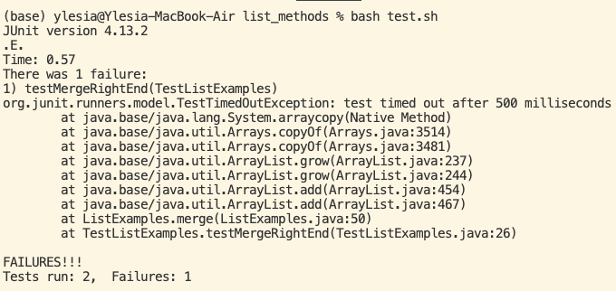

# Lab Report 5

### Part 1 - Debugging Scenario

1. Student:

Hello, I am trying to test my list methods but one of my tests is failing.



My ListExamples class looks like this:

```
import static org.junit.Assert.*;
import org.junit.*;
import java.util.Arrays;
import java.util.List;

class IsMoon implements StringChecker {
  public boolean checkString(String s) {
    return s.equalsIgnoreCase("moon");
  }
}

public class TestListExamples {
  
  @Test
  public void testFilter() {
    List<String> input = Arrays.asList("MOON", "mooN", "sUn");
    List<String> merged = ListExamples.filter(input, new IsMoon());
    List<String> expected = Arrays.asList("MOON", "mooN");
    assertEquals(expected, merged);
  }
  
  @Test(timeout = 500)
  public void testMergeRightEnd() {
    List<String> left = Arrays.asList("a", "b", "c");
    List<String> right = Arrays.asList("a", "d");
    List<String> merged = ListExamples.merge(left, right);
    List<String> expected = Arrays.asList("a", "a", "b", "c", "d");
    assertEquals(expected, merged);
  }
}
```


